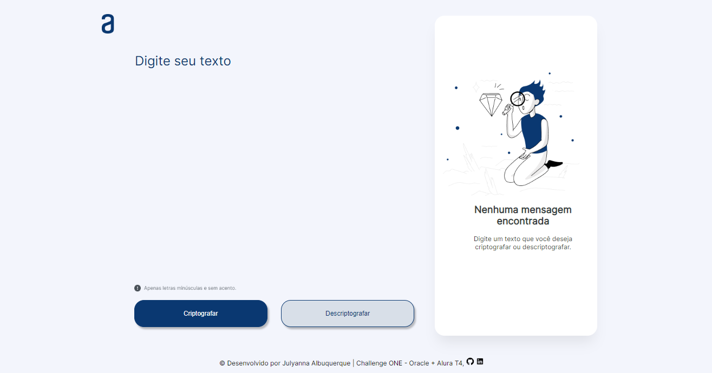

# Challenge decodificador de palavras!🔍

 <p align="center">
     
 </p>
 
<h2>📌Sobre o projeto:</h2>
O projeto faz parte da primeira fase da seleção ONE (Oracle Next Education) em parceria com a Alura e possui como objetivo a criptografia de textos. Para melhor visualização, o projeto encontra-se em deploy <a href="https://julyannaalbuquer.github.io/challenge-decodificador/">aqui</a> 

### 🔐Sobre a criptografia:
#### Chaves da criptografia!
- ```A letra "e" é convertida para "enter".```
- ```A letra "i" é convertida para "imes".```
- ```A letra "a" é convertida para "ai".```
- ```A letra "o" é convertida para "ober".```
- ```A letra "u" é convertida para "ufat".```

### 📍Alguns outros requisitos:

- [x] Deve funcionar apenas com letras minúsculas.
- [x] Não devem ser utilizadas letras com acentos ou caracteres especiais.
- [x] Deve ser possível converter uma palavra criptografada e também retornar uma palavra criptografada para a versão original.
- [x] A página deve ter campos para inserção do texto a ser criptografado ou descriptografado, e a pessoa usuária deve poder escolher entre as duas opções.
- [x] O resultado deve ser exibido na tela.

<h2>🖥Preview da tela:</h2>

